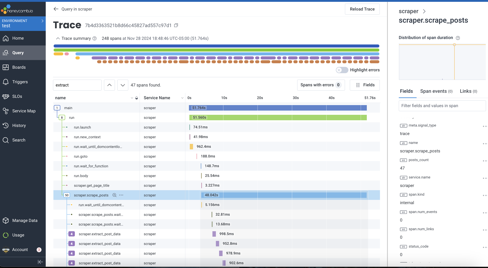
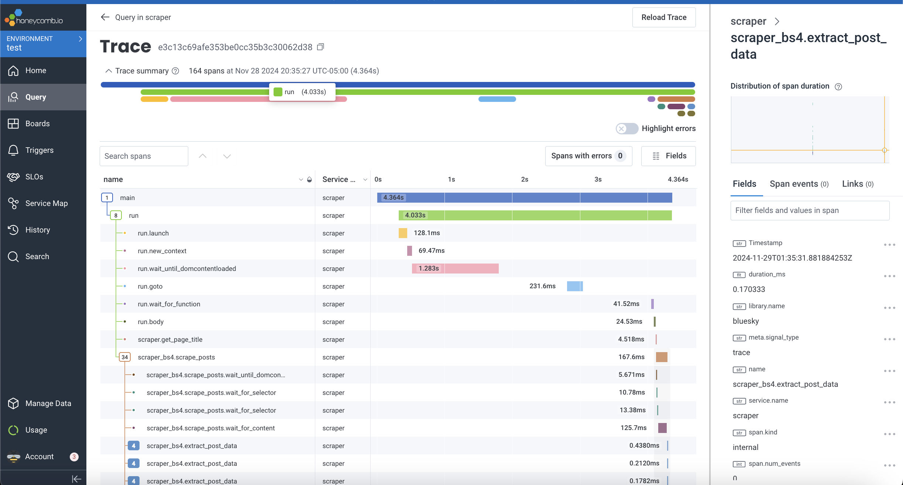

# Bluesky Scraper

## Running

```
make run
```

## Exploration

```
make debug
```

The above command will now run something like this:
```
xhost +localhost

export DISPLAY=host.docker.internal:0

docker run -it \
    -v /tmp/.X11-unix:/tmp/.X11-unix \
    -e DISPLAY=host.docker.internal:0 \
    --rm --ipc=host playw ipython
```

Once you get that container running you can execute code like the following:

```python
 # This is needed to use sync API in repl.
import nest_asyncio; nest_asyncio.apply()
from playwright.sync_api import sync_playwright

pw = sync_playwright().start()
browser = pw.chromium.launch(headless=False)
page = browser.new_page()
page.goto("https://bsky.app/")
print(page.title())

visible_text = page.locator("body").inner_text()
visible_text.index('sometext')
visible_text.count('\n\u202a')

# Get the first username.
page.wait_for_selector('span.css-1jxf684')
username = page.locator('span.css-1jxf684').nth(0).inner_text().strip()

# Grab posts.
post_containers = page.locator('div.css-175oi2r.r-13awgt0')
post_containers.count()  # can be something like ~50.
container = post_containers.nth(0)

# Even values are usernames, odd values are handles.
username = container.locator('span.css-1jxf684').nth(0).inner_text().strip()
handle = container.locator('span.css-1jxf684').nth(1).inner_text().strip()
txt = container.locator('div[data-testid="postText"]').nth(0).inner_text().strip()
container.locator('css-175oi2r r-1awozwy r-18u37iz r-1w6e6rj r-1udh08x r-l4nmg1').nth(0).inner_text().strip()

# Exploring the entire feed.
# <div class="css-175oi2r">
posts = page.locator('div.css-175oi2r')  # Top-level container for each post.
# Direct parent container of posts.
posts = page.locator('div.css-175oi2r').locator('> div > div.css-175oi2r.r-1loqt21.r-1otgn73 > div.css-175oi2r.r-1loqt21.r-1hfyk0a.r-ry3cjt')

post = posts.nth(0)
post = post.locator('div.css-175oi2r.r-18u37iz.r-1cvj4g8 > div.css-175oi2r.r-13awgt0.r-bnwqim.r-417010')
post = post.locator('> *')

post.count()  # SHould be 3.

def get_first_child(locator):
    if locator.locator("> *").count() > 0:
        return locator.locator("> *").nth(0)
    else:
        return None

child = get_first_child(post)
child = get_first_child(child)
child = get_first_child(child)

child.locator('> a').count() == 2

child = child.locator('> a')

remove_chars = {ord('\u202a'): None, ord('\u202c'): None, ord('\xa0'): None}

username = child.nth(0).inner_text().translate(remove_chars).strip()
handle = username = child.nth(1).inner_text().translate(remove_chars).strip()

# Quick way to get the time
post.nth(0).inner_text().translate(remove_chars).split('\n')  # The last element is the timestamp.

# To get just the text
get_first_child(post.nth(1)).inner_text()

# To scroll down.
page.evaluate("window.scrollBy(0, window.innerHeight)")

browser.close()
pw.stop()
```

---

# Design

We use playwright to navigate to a page and then dump the HTML to beautifulsoup.
We used to use playwright for everythign but even with all the asyncs it still took too much time (relatively speaking).

This is what execution with just async and playwright looked like


This is what it looked like when we dumped the page's content into beautifulsoup and continued the parsing there


---

# References

1. https://scrapfly.io/blog/web-scraping-with-playwright-and-python/
1. https://playwright.dev/python/docs/library
1. https://github.com/jessfraz/dockerfiles/blob/master/chrome/stable/Dockerfile
1. https://github.com/jessfraz/dockerfiles/blob/master/firefox/Dockerfile
1. https://playwright.dev/docs/docker
1. https://mcr.microsoft.com/en-us/artifact/mar/playwright/tags
